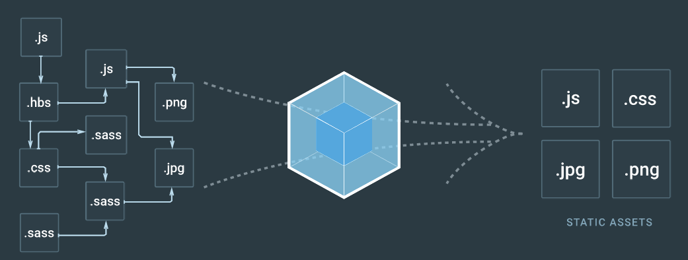

# Javascript Tooling

Now we will use some tool to improve practice of javascript.

##  Prettier

[Prettier](https://prettier.io/) is an opinionated code formatter which have some benefits :

* Use consistent code format accross files
* Share same format practices between team members

1. install prettier as a dev dependency

```zsh
npm i -D prettier
```

2. add `prettier` to `script` section of your `package.json` which should look like :

```json
{
  ...
  "scripts": {
    "test": "jest",
    "prettier":
      "prettier --single-quote --trailing-comma es5 --write \"./src/**/*.js\" "

  },
  ...
}
```

To understand options you can read [prettier doc](https://prettier.io/docs/en/options.html)

3. If you use VSCode, you can integrate prettier :

* install [prettier plugin ](https://marketplace.visualstudio.com/items?itemName=esbenp.prettier-vscode)
* Alter code user parameters (menu : Code > Préférences > Paramètres ) to add :

```json
  "editor.formatOnSave": true,
  "prettier.singleQuote": true,
  "prettier.trailingComma": "es5"
```

4. To use prettier to fix your code, just run

```zsh
npm run prettier
#or
./node_modules/.bin/prettier --single-quote --trailing-comma es5 --write "./src/**/*.js"
```

##  ESLint

[ESLint](https://eslint.org/) is a tool for identifying and reporting on patterns found in ECMAScript/JavaScript code, with the goal of making code more consistent and avoiding bugs. ESlint have two kind of rules : **Formatting rules** and **Code quality rules**

We delegated formatting rules to prettier which alleviates the need for this whole category of rules! Prettier is going to reprint the entire program from scratch in a consistent way, so it's not possible for the programmer to make a mistake there anymore :)

Using ESLint for code quality [rules](https://eslint.org/docs/rules/) avoid a lot of dummy bugs that can be statically detected and encourage best practices in code.

1. Install ESLint

```zsh
npm i -D eslint
```

2. Setup your rules

You can setup each rules in ESLint. For the purpose of this course, I decide to use [Airbnb guidelines](https://github.com/airbnb/javascript) which are fines ! Many of those practices can be checked with ESLint.

```zsh
./node_modules/.bin/eslint --init
#select 'Use a popular style guide'
#select 'Airbnb'
#answer N to the question
#select 'JSON'

touch .eslintignore
```

You have two file : `.eslintrc.json` define the configuration and `.eslintignore` tell eslint to ignore some files.

3. Edit .eslintrc.json

```json
...
  "env": {
    "jest": true,
    "node": true
  }
...
```

This defines global variables that are predefined.

4. Work with Prettier

```zsh
npm i -D eslint-config-prettier
```

This plugin may turn off ESLint's formatting rules.

Edit `.eslintrc.json` extends ton have `"extends": ["airbnb-base", "prettier"],`

5. If you use VSCode, you can integrate eslint :

* install [eslint plugin ](https://marketplace.visualstudio.com/items?itemName=esbenp.prettier-vscode)
* Alter code user parameters (menu : Code > Préférences > Paramètres ) to add :

```json
    "eslint.autoFixOnSave": true
```

This will auto fix your code on save when using VSCode.

6. Add a new script in your `package.json`

```json
{
...
  "scripts": {
  "test": "jest",
  "prettier": "prettier --single-quote --trailing-comma es5 --write \"./src/**/*.js\"  ",
  "eslint": "eslint . --fix"
  },
...
}
```

### Exercice 4

Run prettier and eslint on your code from exercices 1 to 3. Fix problems that eslint can't fix atomatically.

## Pre-commit hook

We defined good practices about code. The last thing we want is to generate GIT DIFF because someone commit before using eslint and prettier.

If you have your own GIT server you could define pre-commit hooks server-side. But here we're using Github ! (╥﹏╥)
Sure you could use pre-commit hook client side but each developer need to setup the hook : how to be sure that everybody use the hook ? To do so we will use `lint-staged` and `husky` libs !

```zsh
npm i -D lint-staged husky
```

Then we will modify our `package.json`

```json
{
...
  "scripts": {
    "precommit": "lint-staged",
    ...
  },
  "lint-staged": {
    "linters": {
      "*.{js,json}": [
        "prettier-eslint --single-quote --trailing-comma es5 --write",
        "git add"
      ],
      "*.js": ["eslint --fix", "git add"]
    },
    "concurrent": false
  },
...
}
```

This will apply prettier and eslint on each file after each commit and add to commit modified files if any. ᕦ(ò_óˇ)ᕤ

##  Babel

### Create a simple http server

create a `server.js` file using [`http` module of node.js](https://nodejs.org/dist/latest-v8.x/docs/api/http.html)

```js
import http from 'http';

const server = http.createServer((request, response) => {
  response.writeHead(200, { 'Content-Type': 'text/json' });
  response.write('{"message" : "Aaaaaaarg"}');
  response.end();
});

server.listen(8080);
console.log('Server is listening');
```

and add

```json
{
...
  "scripts": {
  "start" : "node src/server.js",
  "test": "jest",
  "prettier": "prettier --single-quote --trailing-comma es5 --write \"./src/**/*.js\" ",
  "eslint": "eslint . --fix"
  },
...
}
```

```zsh
npm start
```

Ooops ! It fails !

```zsh
/server.js:1
(function (exports, require, module, __filename, __dirname) { import http from 'http';
                                                              ^^^^^^

SyntaxError: Unexpected token import
    at createScript (vm.js:80:10)
    at Object.runInThisContext (vm.js:139:10)
    at Module._compile (module.js:599:28)
    at Object.Module._extensions..js (module.js:646:10)
    at Module.load (module.js:554:32)
    at tryModuleLoad (module.js:497:12)
    at Function.Module._load (module.js:489:3)
    at Function.Module.runMain (module.js:676:10)
    at startup (bootstrap_node.js:187:16)
    at bootstrap_node.js:608:3
```

It's because node.js doesn't implement the full Ecmasript specification. In our exemple, `import` instruction isn't supported. When you code in Javascript you're dependent to the javascript runtime (node.js which is build on the top of Google V8 engine). In this case, we should just decide to use `requirejs` which is implement by node.js and replace the first line of our code by `const http = require('http');`

Considering that the market have 4 main engines : Microsoft Chakra, Google V8, Mozilla Servo (written in Rust to replace Gecko and released few month ago), Apple Webkit ; and many minor ones like Oracle Nashorn included in Open JDK.

Considering that Ecmascript evolves quickly with one release each year since ES6 (ES2015), you had ES7(2016), ES2017, ES2018 !

Furthermore Ecmascript proposals follow 5 stages :

* Stage 0 : Strawman
* Stage 1 : Proposal
* Stage 2 : Draft
* Stage 3 : Candidate
* Stage 4 : Finished

So when you use Javascript you need a way to run your code regardless of the runtime implementation (even more on client side), regardless of the version of Ecmascript you decide to follow ... even if you decide to use a non validated specification - at your own risk.

To do that you need `polyfills` (emulation prosthesis) and that exactly what `Babel` do.

### Setup babel

1. Install babel, env preset, stage 3 preset and eslint plugin

```zsh
npm i -D babel-cli babel-preset-env babel-preset-stage-3 babel-eslint
touch .babelrc
```

2. Edit .babelrc

```json
{
  "presets": [
    "stage-3",
    [
      "env",
      {
        "targets": {
          "node": "current"
        }
      }
    ]
  ]
}
```

The first preset allow you to [use stage 3](http://babeljs.io/docs/plugins/preset-stage-3/) possibilities like [Object rest spread transform](http://babeljs.io/docs/plugins/transform-object-rest-spread/)

The second preset is more clever : [env preset](https://babeljs.io/docs/plugins/preset-env/) know what to polyfill regarding your target runtime (default node.js version on your computer in our config)

3. Edit .eslintrc.json

```json
{
  "parser": "babel-eslint",
  "extends": ["airbnb-base", "prettier"],
  "env": {
    "jest": true,
    "node": true
  }
}
```

4. Edit package.json

```json
{
...
  "scripts": {
  "dev" : "babel-node src/server.js",
  "build" : "babel src/server.js -d build",
  "start" : "node build/server.js",
  "test": "jest",
  "prettier": "prettier --single-quote --trailing-comma es5 --write \"./src/**/*.js\" ",
  "eslint": "eslint . --fix"
  },
...
}
```

5. Test your scripts

Babel give you a bin `babel-node` which transform on the fly.

```zsh
npm run dev
#In another terminal
curl http://127.0.0.1:8080
```

It works ! (•̀ᴗ•́)و

But when you should not use babel-node for anything else than development.

```zsh
npm run build
npm start
#In another terminal
curl http://127.0.0.1:8080
```

Take a look at `build/server.js` !
Now you know how build javascript for remote environments.

It's better
“ヽ(´▽ ｀)ノ”

6. Make ESlint ignore builded files

Add `build` on the first row of `.eslintignore` file.
If you want understand, [read the doc](https://eslint.org/docs/user-guide/configuring#ignoring-files-and-directories).

7. Use a watcher for dev

* Install babel-watch

```zsh
npm i -D babel-watch
```

* modify package.json

```json
{
...
  "scripts": {
  "dev" : "babel-watch src/server.js",
  ...
  },
...
}
```

`babel-watch` is just `babel-node` with a watcher enable. Try `npm run dev` then alter and save `server.js` <(^\_^)>

##  Webpack

At its core, webpack is a static module bundler for modern JavaScript applications. When webpack processes your application, it recursively builds a dependency graph that includes every module your application needs, then packages all of those modules into one or more static bundles.



1. Install webpack and babel loader

```zsh
npm i -D webpack babel-loader
```

2. Configuration

   The config of Webpack is in `webpack.config.js`. I setup the conf for this exemple. To unterstand I highly recommend to read [Webpack documentation](https://webpack.js.org/concepts/) which is probably one of the best exemple of what a documentation should be.

3. Modify package.json

```json
...
  "scripts": {
    "dev": "babel-node src/server.js",
    "build": "babel src -d build",
    "start": "node build/server.js",
    "start:bundle" : "node build/webpack/index.js",
    "test": "jest",
    "eslint": "eslint . --fix",
    "prettier": "prettier --single-quote --trailing-comma es5 --write \"./src/**/*.js\" ",
    "webpack": "webpack"
  },
...
```

and try

```zsh
npm run webpack
npm run start:bundle
```

### exercice 5

Alter `server.js` to return the result of `findNextSquare` function you define in `ex1.js`.

* Since we have setup babel, you should use the `import` syntax instead of requireJS syntax we used in `ex1.test.js`. In `server.js` : `import findNextSquare from './ex1' ;`
* Get a header `square` from the request as the parameter of the function. [How I do that ?](https://nodejs.org/dist/latest-v8.x/docs/api/http.html#http_request_getheader_name)
* Bundle and run your code
* Take a look at the bundle - don't do that when your code grow (◔_◔)
* Test with :

```zsh
curl --header "square: 121" http://127.0.0.1:8080 #should return 144 in the response message.
```

Go to next step [Discover Node.js](./NODE.md)
